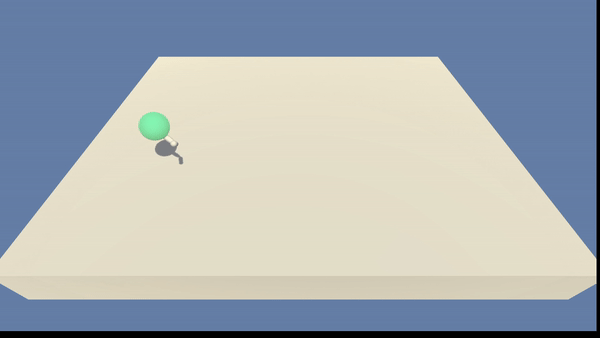

# Reacher Udacity

In this project, the agent is a double-jointed robotic arm that must learn how to reach the goal
position represented by a green sphere. To achieve this goal, the method used was
[Deep Deterministic Policy Gradient](https://arxiv.org/abs/1509.02971), implemented
with [Prioritized Experience Replay](https://arxiv.org/abs/1511.05952).

---

# Table of Contents

- [The environment](#the-environment)
- [Dependencies](#dependencies)
- [Getting Started](#getting-started)
  - [Linux (Debian-based)](#linux-debian-based)
- [Demo](#demo)
- [Running the application](#running-the-application)

---

# The environment

The agent receives a reward for every time step that it successfully reaches the goal location.

An observation of the environment is composed by a vector with 33 elements, which represents each
joint's position, rotation, linear and angular velocity. To interact with the environment, the agent
is capable of applying torque to each of its joints. The intensity of the applied torque must be
between *-1* and *1*.

This is an episodic task with a continuous action space. An episode ends after reaching 1002 time
steps. This could be easily transformed into a continuous task by simply ignoring the terminal
states and instead collected a number of time steps representing each episode.

This project is considered solved if the agent achieves an average reward of 30.0 for the next 100
episodes. In this implementation, the best result obtained was an average reward of 37.36 after 412
episodes.

---

# Dependencies

This project is a requirement from
the [Udacity Deep Reinforcement Learning Nanodegree](https://www.udacity.com/course/deep-reinforcement-learning-nanodegree--nd893)
. The environment is provided by Udacity. It depends on the following packages:

- Python 3.6
- Numpy
- PyTorch
- Unity ML-Agents Beta v0.4

---

# Getting Started

## Linux (Debian-based)

- Install python3.6 (any version above is not compatible with the unity ml-agents version needed for
  this environment)

``` bash
sudo add-apt-repository ppa:deadsnakes/ppa
sudo apt update
sudo apt install python3.6-full
```

- (Optional) Create a virtual environment for this project

```bash
cd <parent folder of venv>
python3.6 -m venv <name of the env>
source <path to venv>/bin/activate
```

- Install the python dependencies

``` bash
python3 -m pip install numpy torch
```

- Download the Unity
  ML-Agents [release file](https://github.com/Unity-Technologies/ml-agents/releases/tag/0.4.0b) for
  version Beta v0.4. Then, unzip it at folder of your choosing
- Build Unity ML-Agents

```bash
cd <path ml-agents>/python
python3 -m pip install .
```

- Clone this repository and download the environment created by Udacity and unzip it at the world
  folder

```bash
git clone https://github.com/jhonasiv/reacher-udacity
cd reacher-udacity
mkdir world
wget https://s3-us-west-1.amazonaws.com/udacity-drlnd/P2/Reacher/one_agent/Reacher_Linux.zip
unzip Reacher_Linux.zip -d world
```

---

# Demo

After training the agent until a rolling average reward of 35.0 was reached for 100 episodes, this
is how it looks.

<p align="center">
  
  <p align="center">Agent trained with an average score of 35.0</p>
</p>

---

# Running the application

- Execute the main.py file
  ```bash
  python3 src/main.py
  ```
- For more information on the available command line arguments, use:
  ```bash
  python3 src/main.py --help
  ```
    - Some notable cli arguments:
        - `--eval`: runs the application in evaluation mode, skipping training step, `model_path`
          must be set
        - `--buffer_size`: maximum size of the experience buffer.
        - `--a_lr`: learning rate for the actor
        - `--c_lr`: learning rate for the critic
