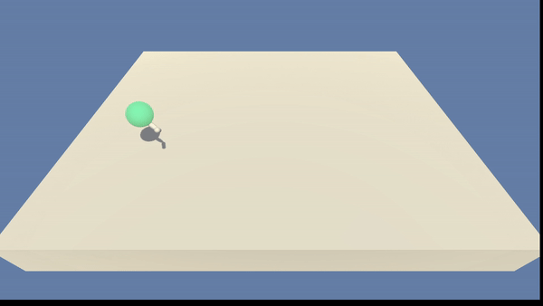
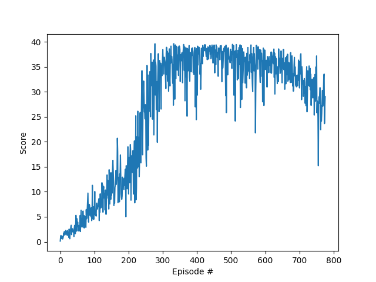

# Table of contents

- [Implementation](#implementation)
    - [Parameters](#parameters)
    - [Network architecture](#network-architecture)
    - [Learning algorithm](#learning-algorithm)
- [Results](#results)
- [Future Work](#future-work)

# Implementation

To solve the Reacher challenge, I implemented a
[Deep Deterministic Policy Gradient](https://arxiv.org/abs/1509.02971)
architecture combined with [Prioritized Experience Replay](https://arxiv.org/abs/1511.05952). Some
of the hyperparameters used in this implementation are described below.

## Parameters

- `Actor Learning rate`: 5e-5
- `Critic Learning rate`: 1e-4
- `Step-size for soft update`: 1e-3
- `Discount rate`: 0.99
- `Update target every ... episodes`: 1
- `Minibatch size`: 32
- `Alpha`: 0.6
- `Initial value for beta`: 0.4
- `Seed`: 0

In order to explore new actions, an Ornstein-Uhlenbeck noise is added to the action determined by
the actor. To convey an exploitative atitude after learning more about the problem, the noise is
multiplied by a linearly annealed constant. This constant goes from 0.5 to 0.01 after 200000 time
steps.

## Network architecture

The model architectures used for the Actor and the Critic were the following:

- *Actor*:

1. `Linear(in_features=33, out_features=128)`
2. `ReLU()`
3. `Linear(in_features=128, out_features=128)`
4. `ReLU()`
5. `Linear(in_features=128, out_features=4)`
6. `TanH()`

- *Critic*:

1. `Linear(in_features=33, out_features=128)`
2. `ReLU()`
3. `Linear(in_features=132, out_features=128)`
4. `ReLU()`
5. `Linear(in_features=128, out_features=1)`

## Learning algorithm

The learning algorithm used was the DPPG.
This algorithm combines concepts from Actor-Critic algorithms and the DQN algorithm.
By keeping the experience replay buffer and the slowly changing target networks from DQN, the 
DDPG is able to review previous experiences and improve from them.
The main difference from the DQN algorithm is the Actor and Critic networks.
The actor is a neural network that evaluates the action that must be taken for a state, while 
the critic evaluates the Q-value for each state-action pair.
The target networks are updated slowly from the local network parameters.

An update consists in sampling a minibatch of experiences are from the replay buffer.
An experience consists of a tuple of (states, actions, rewards, next_states, dones).
Then, the target actor network calculates the actions to be taken for the sampled next states.
The value of these next_state-action pairs is calculated by the target critic network, and then 
used to calculate the estimated Q-value of the sampled next states.
After this, the local critic calculates the expected Q-value for the state-action pairs.
The critic loss is calculated using the Mean Square Error between the expected Q-value and the 
target estimated Q-value.
While the actor loss is calculated by negating the local critic estimated value for actions 
predicted by the local actor, which is now an updated version from the one that was used in the 
sample experience.
This process is made clearer by inspecting the [source code](src/agent.py).

# Results

The environment was solved after `226` episodes, achieving the average score of `30.0` over the
next `100` episodes.

After `276` episodes, the agent manage to achieve a rolling average score of `35.0`.
After that, the agent improved until it reached its peak performance of `37.36` after 412 episodes.
The gif below showcases the agent's performance after `276` episodes

    
    
Agent trained with the average score of 35.0

The plot below describes the scores obtained during training.

    
    
Scores plot obtained during training

# Future work

To improve upon the knowledge I gathered throughout the Nanodegree, it is interesting to 
implement alternative methods, such as A2C, GAE and A3C.
Besides, solving the problem for multiple agents is a great way to grasp the potential of these 
methods.
